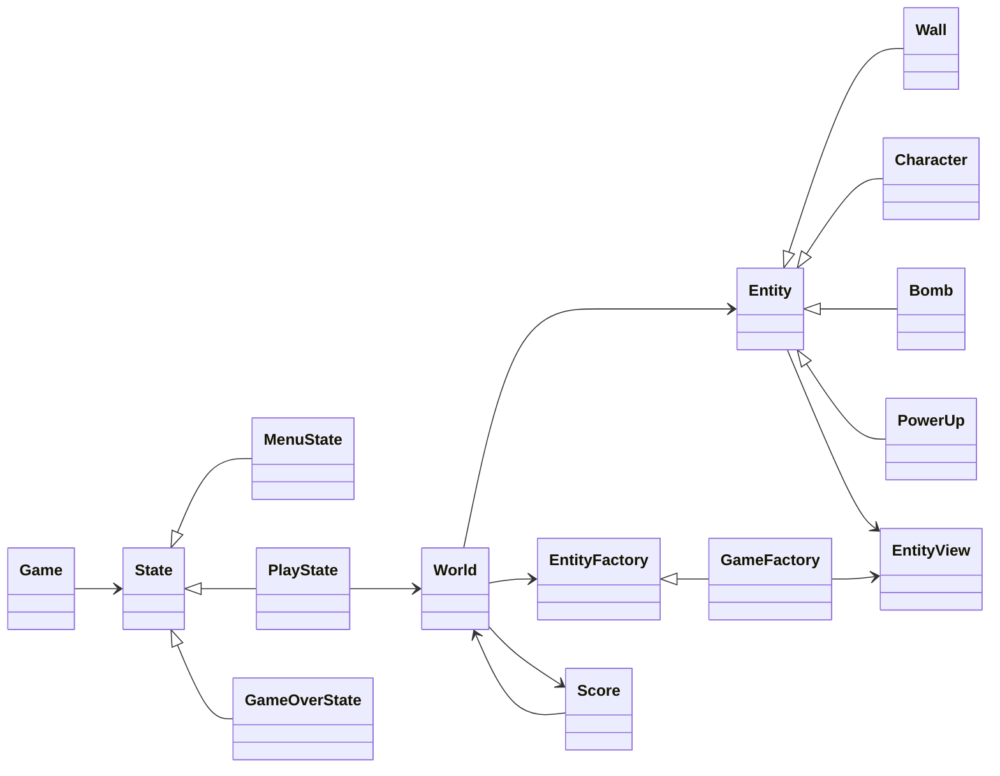

# Bomberman

## Project details

Name: Dara van Engelen  
Student number: 20235106

GitHub repository: https://github.com/daravanengelen/Bomberman

# Bomberman design overview

This project is a Bomberman-style game implemented with a clear split between logic and presentation. The game logic is built as a reusable library, while the SFML layer handles rendering, input, and menu screens.

## Design choices

- Logic / view separation: the core rules live in the `libs/logic` target and are independent from SFML, while `src/view` handles the graphical window and states.
- Model / controller / view structure: `Entity` and `World` model the game state and rules, while `State` classes and `EntityView` classes deal with UI and drawing.
- Observer pattern: entities and the world notify views and score tracking objects when they move, explode, or collect items.
- Abstract factory pattern: `EntityFactory` defines the creation of walls, players, bombs, and power-ups, and the SFML implementation creates matching view objects.
- Normalized coordinates: gameplay uses world coordinates centred around the arena rather than raw pixels, with a `Camera` translating between logic and rendering space.
- Score and persistence: match events update a `Score` object and save the top five results to `scores.txt`.

## Class structure

## Shortcomings

- Opponent AI is present but still relatively basic. The bots do not yet make strategic decisions consistently, so their behaviour is predictable and does not fully challenge the player.
- Bomb explosion animations and some other animations, such as death animations, are not yet implemented. Explosions are functional in the game logic, but the visual effect for blasts and impact remains minimal compared to a fully polished Bomberman presentation.
- The game currently prioritises core gameplay and architecture over advanced animation and higher-quality enemy behaviour.

## Summary

The project follows the expected Bomberman structure: a reusable logic core, a separate graphical layer, and a small set of gameplay systems that keep the architecture modular and extendable.

